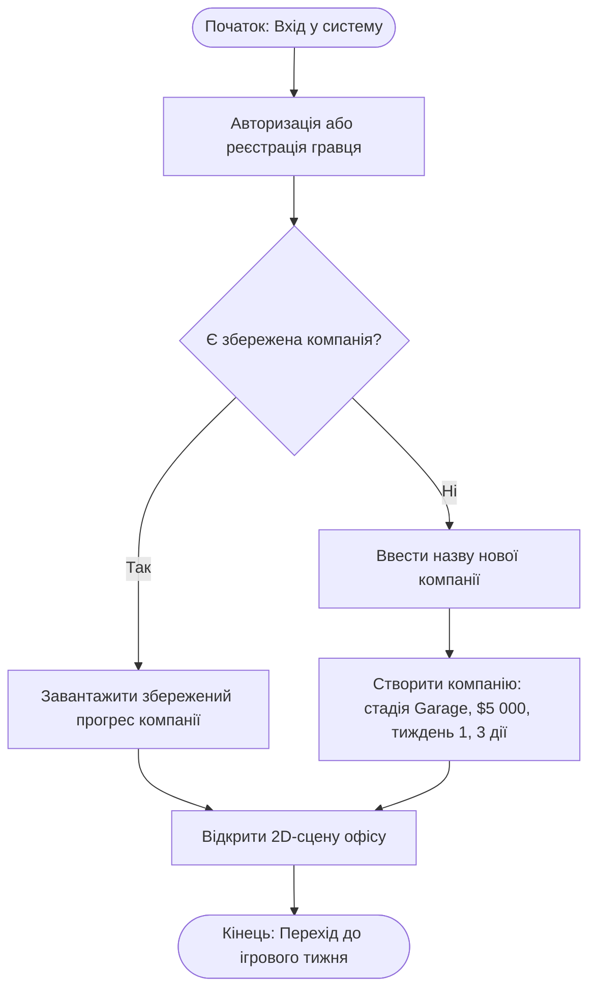

# Activity Diagram — UC-01 «Створити компанію та завантажити прогрес»

```mermaid
flowchart TD
    Start(["Початок: Вхід у систему"]) --> Auth["Авторизація або реєстрація гравця"]
    Auth --> HasSave{"Є збережена компанія?"}

    HasSave -- Так --> LoadSave["Завантажити збережений прогрес компанії"]
    LoadSave --> OpenOffice["Відкрити 2D-сцену офісу"]

    HasSave -- Ні --> EnterName["Ввести назву нової компанії"]
    EnterName --> InitCompany["Створити компанію: стадія Garage, $5 000, тиждень 1, 3 дії"]
    InitCompany --> OpenOffice

    OpenOffice --> End(["Кінець: Перехід до ігрового тижня"])
```
