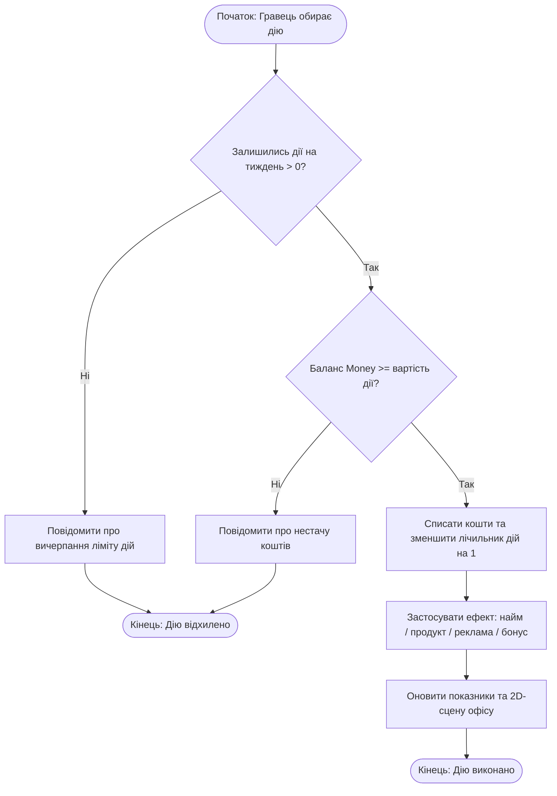

# Activity Diagram — UC-02 «Виконати управлінську дію тижня»

```mermaid
flowchart TD
    Start(["Початок: Гравець обирає дію"]) --> CheckActions{"Залишились дії на тиждень > 0?"}
    CheckActions -- Ні --> ErrActions["Повідомити про вичерпання ліміту дій"]
    ErrActions --> EndFail(["Кінець: Дію відхилено"])

    CheckActions -- Так --> CheckMoney{"Баланс Money >= вартість дії?"}
    CheckMoney -- Ні --> ErrMoney["Повідомити про нестачу коштів"]
    ErrMoney --> EndFail

    CheckMoney -- Так --> Deduct["Списати кошти та зменшити лічильник дій на 1"]
    Deduct --> ApplyEffect["Застосувати ефект: найм / продукт / реклама / бонус"]
    ApplyEffect --> UpdateUI["Оновити показники та 2D-сцену офісу"]
    UpdateUI --> EndSuccess(["Кінець: Дію виконано"])
```
