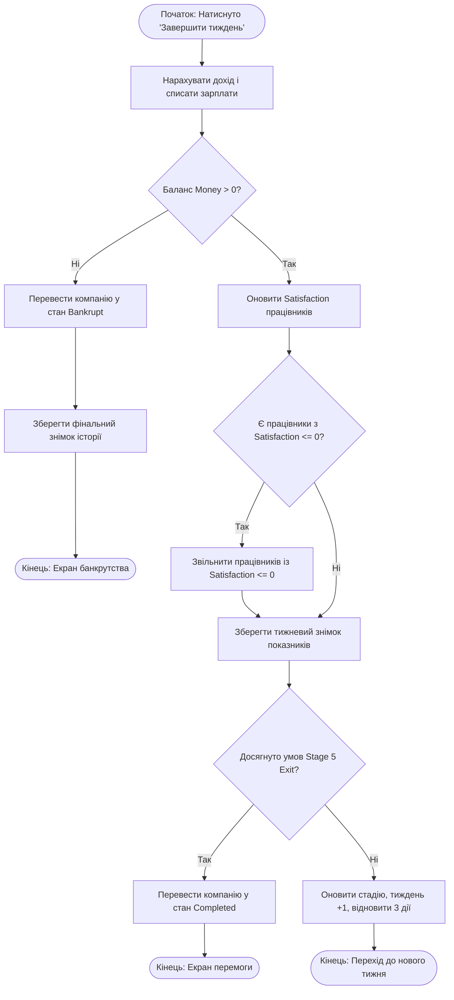

# Activity Diagram — UC-03 «Завершити ігровий тиждень»

```mermaid
flowchart TD
    Start(["Початок: Натиснуто 'Завершити тиждень'"]) --> CalcFinance["Нарахувати дохід і списати зарплати"]
    CalcFinance --> CheckMoney{"Баланс Money > 0?"}

    CheckMoney -- Ні --> SetBankrupt["Перевести компанію у стан Bankrupt"]
    SetBankrupt --> SaveLoss["Зберегти фінальний знімок історії"]
    SaveLoss --> EndLoss(["Кінець: Екран банкрутства"])

    CheckMoney -- Так --> UpdateSat["Оновити Satisfaction працівників"]
    UpdateSat --> CheckSat{"Є працівники з Satisfaction <= 0?"}

    CheckSat -- Так --> FireEmp["Звільнити працівників із Satisfaction <= 0"]
    FireEmp --> SaveSnap["Зберегти тижневий знімок показників"]
    CheckSat -- Ні --> SaveSnap

    SaveSnap --> CheckWin{"Досягнуто умов Stage 5 Exit?"}
    CheckWin -- Так --> SetWin["Перевести компанію у стан Completed"]
    SetWin --> EndWin(["Кінець: Екран перемоги"])

    CheckWin -- Ні --> NextWeek["Оновити стадію, тиждень +1, відновити 3 дії"]
    NextWeek --> EndTurn(["Кінець: Перехід до нового тижня"])
```
