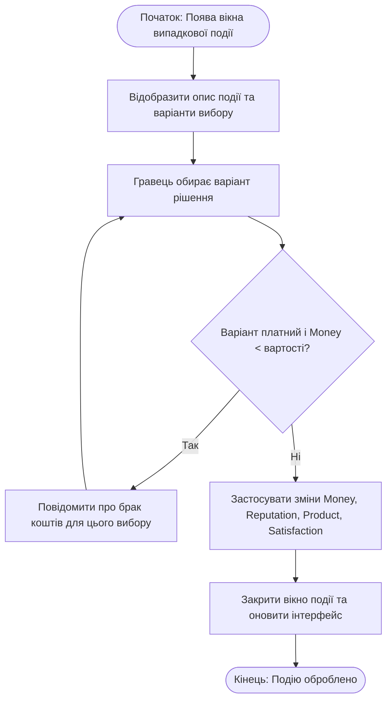

# Activity Diagram — UC-04 «Обробити випадкову подію»

```mermaid
flowchart TD
    Start(["Початок: Поява вікна випадкової події"]) --> ShowEvent["Відобразити опис події та варіанти вибору"]
    ShowEvent --> ChooseOption["Гравець обирає варіант рішення"]
    ChooseOption --> CheckCost{"Варіант платний і Money < вартості?"}
    
    CheckCost -- Так --> WarnMoney["Повідомити про брак коштів для цього вибору"]
    WarnMoney --> ChooseOption
    
    CheckCost -- Ні --> ApplyDelta["Застосувати зміни Money, Reputation, Product, Satisfaction"]
    ApplyDelta --> CloseModal["Закрити вікно події та оновити інтерфейс"]
    CloseModal --> EndEvent(["Кінець: Подію оброблено"])
```