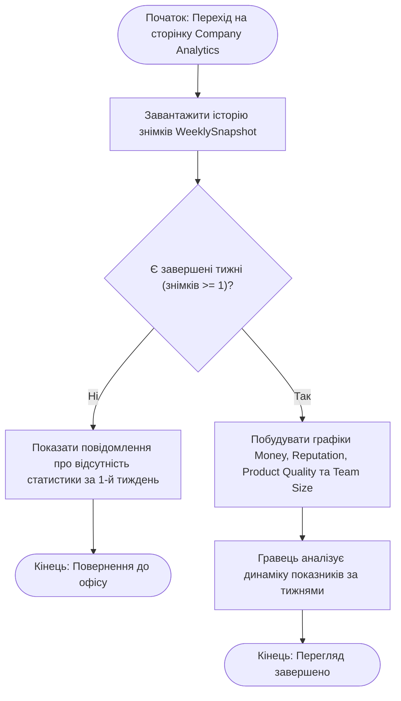

# Activity Diagram — UC-05 «Переглянути аналітику компанії»

```mermaid
flowchart TD
    Start(["Початок: Перехід на сторінку Company Analytics"]) --> FetchSnapshots["Завантажити історію знімків WeeklySnapshot"]
    FetchSnapshots --> HasData{"Є завершені тижні (знімків >= 1)?"}
    
    HasData -- Ні --> ShowEmpty["Показати повідомлення про відсутність статистики за 1-й тиждень"]
    ShowEmpty --> EndEmpty(["Кінець: Повернення до офісу"])
    
    HasData -- Так --> RenderCharts["Побудувати графіки Money, Reputation, Product Quality та Team Size"]
    RenderCharts --> InspectData["Гравець аналізує динаміку показників за тижнями"]
    InspectData --> EndSuccess(["Кінець: Перегляд завершено"])
```